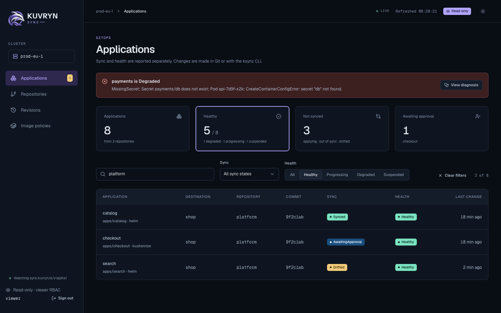
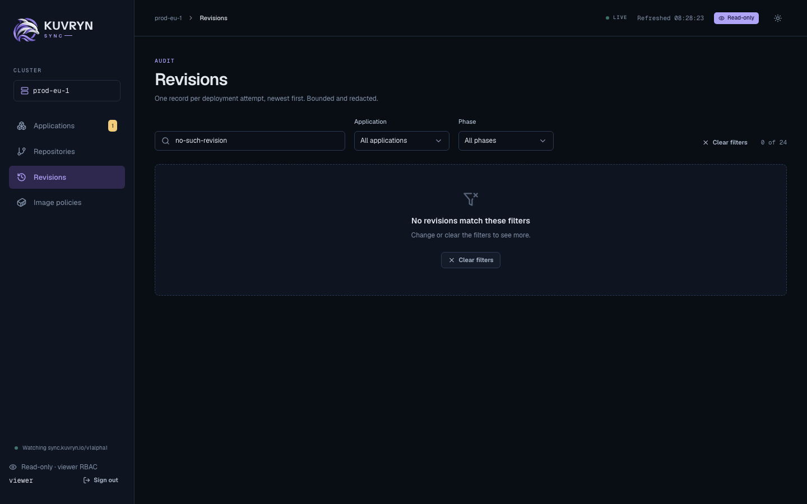
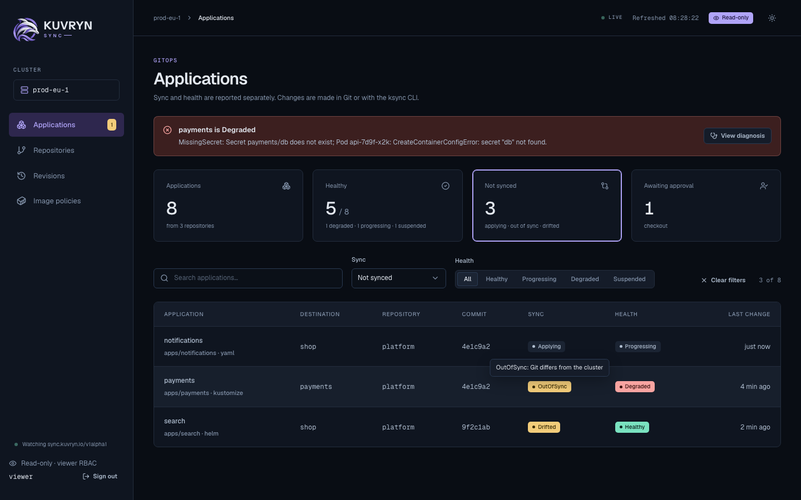

# Web console

`ksync console` serves a read-only web console for people who need to see
Kuvryn Sync state without a kubeconfig or the CLI:

- application teams checking why an Application is Degraded;
- approvers reading a plan before approving it with `ksync sync`;
- auditors reading Revisions;
- on-call staff scanning what is drifted or awaiting approval.

It shows Applications with their diagnosis chain, plan, history and managed
resources, and the Repositories, Revisions and Image policies tables. The
pages refresh every 10 seconds. The console never changes the cluster: where
an action is needed, it shows the exact `ksync` command instead.


## Filter the tables

Each table has filters above it: a search box, and the states present in
the rows, such as Sync and Health on Applications, Application and Phase on
Revisions, State on Repositories, and Kind with "Only not synced or
unhealthy" on an Application's resources. The "Healthy", "Not synced" and
"Awaiting approval" cards set the matching filter. Filters narrow the rows
the page already has, show "N of M", and live in the URL, for example
`/apps?q=platform&health=Healthy`, so they survive a reload and Back and a
link shares them. They work with the chosen namespace.





Tooltips explain what the console abbreviates, on hover and on keyboard
focus: each Sync and Health state, the absolute local time behind "4 min
ago", full commit SHAs, digests, long paths and URLs, the signed-in username,
and what each stat card counts. "Last change" is when an Application's
newest Revision started or finished, or a condition changed, whichever is
latest.



## How access works

The console has no permission model of its own. People sign in, and every
read is made with their own Kubernetes identity, so RBAC decides what each
person sees and the API server's audit log records the reads under their
name. There are two ways to sign in:

- **A Kubernetes token**, always available and the default. It works on any
  cluster, with nothing to install: an operator mints a token, for example
  with `kubectl create token`, and the person pastes it on the login page.
  The console's own ServiceAccount then needs no permissions at all.
- **OIDC**, optional, for clusters that already have single sign-on such as
  Dex. It appears next to the token form once `console.oidc.issuerURL` and
  `console.oidc.clientID` are set. See
  [Set up OIDC sign-in with Dex](#set-up-oidc-sign-in-with-dex).

Either way, the console's client sends only GET requests, never reads
Secrets, and refuses subresources such as logs and exec. The console runs as
its own Deployment and ServiceAccount, and never shares the controller's
credentials.

## Sign in with a Kubernetes token

The login page always shows a **Kubernetes token** field. The form posts the
token in the request body to `POST /auth/token`; it never goes in a URL.

1. The console trims surrounding whitespace and a `Bearer ` prefix, and
   refuses a token larger than 16 KiB, and a JWT whose `exp` has already
   passed, before sending anything.
2. It asks the API server who the token belongs to, with an
   `authentication.k8s.io/v1` SelfSubjectReview sent with that token. That
   needs Kubernetes 1.28 or later. The request carries only the token: none
   of the console's own credentials, and no impersonation. It times out after
   10 seconds.
3. It refuses `system:anonymous`, anyone in `system:unauthenticated`, and
   `system:` users other than ServiceAccounts. ServiceAccount tokens are
   accepted, since the token is used as it is and nothing is impersonated.
4. It seals the token, with the username and groups, into the encrypted
   session cookie (`ksync_session`, AES-256-GCM, HttpOnly, Secure,
   SameSite=Lax). Nothing is stored on the server, and the token is never
   logged or returned by any API.

The session ends at the token's own expiry when it is a JWT, and at most
8 hours after sign-in, whichever comes first. A token that expires or is
revoked earlier makes the next read fail with 401, and the console then
clears the session and returns to the login page. Signing out clears the
console's session only; it does not revoke the token.

Every read in a token session carries the token as its bearer token, so the
console sees exactly what the token's RBAC allows, and the audit log names
the token's user. The console never falls back to its own ServiceAccount.

## Create a viewer token

The built-in `view` ClusterRole does not cover Kuvryn Sync's resources, and
the per-kind `kuvryn-sync-*-viewer-role` ClusterRoles in `dist/install.yaml`
do not aggregate into it; the chart does not install them at all. Give
viewers the `kuvryn-sync-viewer` ClusterRole from
[Grant viewers access](#grant-viewers-access), which reads the
`sync.kuvryn.io` resources and the common kinds the Resources tab shows.

To let someone see the Applications in `team-a`, create a ServiceAccount
there and bind it to that ClusterRole with a RoleBinding, which grants it in
`team-a` only:

```yaml
apiVersion: v1
kind: ServiceAccount
metadata:
  name: console-viewer
  namespace: team-a
---
apiVersion: rbac.authorization.k8s.io/v1
kind: RoleBinding
metadata:
  name: console-viewer
  namespace: team-a
roleRef:
  apiGroup: rbac.authorization.k8s.io
  kind: ClusterRole
  name: kuvryn-sync-viewer
subjects:
  - kind: ServiceAccount
    name: console-viewer
    namespace: team-a
```

Then mint a token and hand it over:

```sh
kubectl create token console-viewer -n team-a --duration=8h
```

A console session never lasts longer than 8 hours, whatever the token's
duration, and the API server may cap `--duration` lower. The person signs in
with the token, picks `team-a` in the namespace picker, and sees what the
RoleBinding allows. For a viewer of every namespace, bind the ClusterRole with
a ClusterRoleBinding instead. Anyone holding the token can read what it can,
so share it like a password, keep durations short, and delete the
ServiceAccount to revoke every token minted for it.

## Install the console with the chart

With no OIDC values the chart renders a token-only console:

```sh
helm upgrade --install kuvryn-sync charts/kuvryn-sync \
  --namespace kuvryn-sync-system \
  --set console.enabled=true --set console.clusterName=prod-eu-1
kubectl -n kuvryn-sync-system rollout status deployment/kuvryn-sync-kuvryn-sync-console
```

The chart creates, all named `<release>-kuvryn-sync-console`:

- the Deployment, running `ksync console` as non-root with a read-only root
  filesystem;
- its ServiceAccount, which has no permissions in a token-only console;
- a Service on port 80;
- the optional Ingress (`console.ingress`);
- with OIDC only, a ClusterRole and ClusterRoleBinding that grant
  `impersonate` on `users` and `groups`.

The console's cookies are `Secure`, so serve it over TLS, for example with
`console.ingress` and a TLS Secret. To try it without an ingress, forward the
Service and open `http://localhost:8080`; browsers treat `localhost` as a
secure origin, and Chrome and Firefox keep the `Secure` cookie there:

```sh
kubectl -n kuvryn-sync-system port-forward svc/kuvryn-sync-kuvryn-sync-console 8080:80
```

Without `console.sessionKey.secretName` the console keeps a random session
key in memory, so a restart signs everyone out; see
[Create the Secrets](#3-create-the-secrets) for a key that lasts.

## Add the console to a raw-manifest install

The raw install, `dist/install.yaml`, does not include the console. Render the
chart's console template on its own and apply it next to it, from a checkout
of the same release tag, so the image matches the controller:

```sh
helm template kuvryn-sync charts/kuvryn-sync --namespace kuvryn-sync-system \
  --set console.enabled=true --set console.clusterName=prod-eu-1 \
  --show-only templates/console.yaml | kubectl apply -n kuvryn-sync-system -f -
```

The rendered objects carry no namespace of their own, so keep the `-n` on
`kubectl apply`; without it they land in the current namespace, usually
`default`.

That is the token-only console: a ServiceAccount, a Deployment and a Service
in `kuvryn-sync-system`, and nothing cluster-wide. Add
`--set console.ingress.enabled=true --set console.ingress.host=...` for an
Ingress, `--set image.pullSecrets[0]=<secret>` for a private image, or the
OIDC values from [Install with OIDC](#4-install-the-console-with-oidc) for
single sign-on. Render again with the same values after upgrading, and remove
it with `kubectl delete -n kuvryn-sync-system -f -` on the same output.

## Set up OIDC sign-in with Dex

OIDC sign-in is optional and sits next to the token form. With it:

- Sign-in uses the authorization code flow with PKCE (S256), state and
  nonce. The ID token's signature, issuer, audience and expiry are verified
  against the issuer's keys.
- The username comes from the ID token claim `--username-claim` (default
  `email`) and the groups from `--groups-claim` (default `groups`). Both
  prefixes are empty by default, so RBAC bindings name users and groups
  exactly as the issuer sends them.

  > **Warning:** with no prefix, the identity provider's users and groups
  > share one namespace with every other way into the cluster. An IdP group
  > named like a group from client certificates, another OIDC authenticator
  > or a cloud provider's IAM mapping is the same group to RBAC, and so is
  > an IdP user named like another authenticator's user. If the cluster has
  > other authenticators, or RBAC bindings to groups the IdP does not own,
  > set a prefix such as `oidc:` with `console.usernamePrefix` and
  > `console.groupsPrefix`, and bind RBAC to the prefixed names
  > (`oidc:acme:platform`). Also restrict the IdP to the organizations and
  > groups that should reach the console, as the Dex examples below do.

- The session cookie expires with the ID token, and no refresh token is
  kept, so users sign in again when it expires.
- Every read impersonates the signed-in user and their groups. The console's
  ServiceAccount may only impersonate `users` and `groups`, and the console
  refuses usernames or groups that start with `system:`.

> **With OIDC, the console's ServiceAccount is as powerful as cluster-admin.**
> Kubernetes lets a holder of `impersonate` on `users` and `groups` act as any
> user or group, `system:masters` included. The console refuses `system:`
> identities, but that check lives only in the console process: anyone who
> obtains the ServiceAccount's token can impersonate cluster-admin directly.
> Treat the release namespace like a cluster-admin credential. Allow nobody
> but cluster admins to exec into its pods, create pods there, or read its
> Secrets. Where you can, list the users and groups the console may
> impersonate in `console.impersonation`, as shown under
> [Restrict whom the console may impersonate](#restrict-whom-the-console-may-impersonate).
> A token-only console has no such permission.

Any OIDC issuer works. This walk-through uses
[Dex](https://dexidp.io/), which the login page's GitHub, GitLab and email
buttons are designed for. Replace `console.example.com` and
`dex.example.com` with your hosts.

### 1. Register the console as a Dex client

Add a static client whose redirect URI is the console's `/auth/callback`:

```yaml
# Dex config.yaml
issuer: https://dex.example.com
staticClients:
  - id: ksync
    name: Kuvryn Sync
    secret: <a long random string>
    redirectURIs:
      - https://console.example.com/auth/callback
```

### 2. Add connectors

Each connector the console offers becomes a button on the login page. Pass
the connector IDs with `console.connectors`, and the console sends Dex's
`connector_id` so users skip Dex's own chooser.

```yaml
connectors:
  - type: github
    id: github
    name: GitHub
    config:
      clientID: $GITHUB_CLIENT_ID
      clientSecret: $GITHUB_CLIENT_SECRET
      redirectURI: https://dex.example.com/callback
      # Only members of these teams can sign in. Their groups arrive as
      # "acme:platform"; bind RBAC to those names.
      orgs:
        - name: acme
          teams: [platform, payments]
      teamNameField: slug
  - type: gitlab
    id: gitlab
    name: GitLab
    config:
      baseURL: https://gitlab.acme.io
      clientID: $GITLAB_CLIENT_ID
      clientSecret: $GITLAB_CLIENT_SECRET
      redirectURI: https://dex.example.com/callback
      # Only members of these GitLab groups can sign in, and only these
      # groups are sent.
      groups: [acme/platform, acme/payments]

# The local connector: "Sign in with email" on the login page. Dex hosts the
# password form, so the console never sees a password.
enablePasswordDB: true
staticPasswords:
  - email: mia.chen@acme.io
    hash: <bcrypt hash>
    username: mia
    userID: 5d5a6c52-0f6a-4b9d-9a36-2b1f4c6e1a01
```

Dex's local users carry no groups, so bind RBAC to their email address.

### 3. Create the Secrets

The OIDC client secret, in the release namespace:

```sh
kubectl -n kuvryn-sync-system create secret generic ksync-console-oidc \
  --from-literal=client-secret='<the Dex client secret>'
```

The session key is 32 bytes, and token sessions use it too. Without one, the console generates a random key
in memory at startup and logs that it did: every restart then signs everyone
out, and replicas cannot share sessions. The chart never generates the key
itself, because a random value in the chart would change on every render, and
a GitOps controller rendering it would rotate the key, and sign everyone out,
on every reconcile. Create it once and keep it:

```sh
head -c 32 /dev/urandom > session-key
kubectl -n kuvryn-sync-system create secret generic ksync-console-session \
  --from-file=session-key=session-key
rm session-key
```

Rotating the session key signs everyone out. `console.replicas` above 1
requires `console.sessionKey.secretName`; the chart refuses to render
otherwise.

### 4. Install the console with OIDC

```yaml
# console-values.yaml
console:
  enabled: true
  oidc:
    issuerURL: https://dex.example.com
    clientID: ksync
    clientSecret:
      secretName: ksync-console-oidc
      key: client-secret
  # Optional for one replica: without it, sessions end when the pod restarts.
  sessionKey:
    secretName: ksync-console-session
    key: session-key
  clusterName: prod-eu-1
  ssoName: Dex
  connectors: [github, gitlab, local]
  docsURL: https://azrtydxb.github.io/kuvryn-sync/
  ingress:
    enabled: true
    className: nginx
    host: console.example.com
    tls:
      - secretName: console-example-com-tls
        hosts: [console.example.com]
```

```sh
helm upgrade --install kuvryn-sync charts/kuvryn-sync \
  --namespace kuvryn-sync-system -f console-values.yaml
kubectl -n kuvryn-sync-system rollout status deployment/kuvryn-sync-kuvryn-sync-console
```

`console.oidc.issuerURL` and `console.oidc.clientID` go together: with only
one of them the chart refuses to render. The redirect URL defaults to
`https://<ingress.host>/auth/callback`; set `console.redirectURL` when the
console is exposed some other way. With OIDC and neither set, the chart
refuses to render. With OIDC the chart also renders the impersonate
ClusterRole and ClusterRoleBinding.

## Chart values

Every chart value:

| Value                                  | Default         | Meaning                                                             |
| -------------------------------------- | --------------- | ------------------------------------------------------------------- |
| `console.replicas`                     | `1`             | More than 1 needs `sessionKey.secretName`.                          |
| `console.enabled`                      | `false`         | Install the console.                                                |
| `console.oidc.issuerURL`               | `""`            | OIDC issuer URL; set with `clientID`, or neither for tokens only.   |
| `console.oidc.clientID`                | `""`            | OIDC client ID; set with `issuerURL`.                               |
| `console.oidc.clientSecret.secretName` | `""`            | Secret with the client secret; empty for a public client.           |
| `console.oidc.clientSecret.key`        | `client-secret` | Key in that Secret.                                                 |
| `console.redirectURL`                  | from ingress    | With OIDC: `https://<host>/auth/callback`; required without a host. |
| `console.usernameClaim`                | `email`         | Claim impersonated as the username.                                 |
| `console.groupsClaim`                  | `groups`        | Claim impersonated as the groups.                                   |
| `console.usernamePrefix`               | `""`            | Prefix added to the username.                                       |
| `console.groupsPrefix`                 | `""`            | Prefix added to each group.                                         |
| `console.sessionKey.secretName`        | `""`            | Secret with the 32-byte session key; empty keeps a key in memory.   |
| `console.sessionKey.key`               | `session-key`   | Key in that Secret.                                                 |
| `console.clusterName`                  | `cluster`       | Name shown in the console.                                          |
| `console.ssoName`                      | `""`            | Names the "Sign in with" button.                                    |
| `console.connectors`                   | `[]`            | Dex connectors offered: `github`, `gitlab`, `local`.                |
| `console.docsURL`, `console.statusURL` | `""`            | Links on the login page.                                            |
| `console.ingress.enabled`              | `false`         | Create an Ingress.                                                  |
| `console.ingress.className`, `.host`   | `""`            | Ingress class and host.                                             |
| `console.ingress.annotations`, `.tls`  | `{}`, `[]`      | Ingress annotations and TLS.                                        |
| `console.resources`                    | small           | Container resources.                                                |

The same settings are `ksync console` flags when you run it yourself:
`--listen`, `--session-key-file`, `--cluster-name`, `--docs-url` and
`--status-url`; for OIDC, `--oidc-issuer-url` and `--oidc-client-id`, which
go together, `--oidc-client-secret-file`, `--redirect-url`,
`--username-claim`, `--groups-claim`, `--username-prefix`, `--groups-prefix`,
`--sso-name` and `--connectors`; and, for local development over plain HTTP
only, `--insecure-cookies`, which refuses to start unless `--redirect-url`
(with OIDC) or `--listen` (without) is on `localhost`, `127.0.0.1` or
`[::1]`.

## Restrict whom the console may impersonate

This applies with OIDC only; a token-only console impersonates nobody. By
default the console's ClusterRole may impersonate any user and any group.
To limit it, list the users and groups that may use the console. Each
non-empty list becomes `resourceNames` on its impersonate rule:

```yaml
console:
  impersonation:
    users: [mia.chen@acme.io, sam.okafor@acme.io]
    groups: [acme:platform, acme:payments]
```

A person whose username or any of whose groups is not listed then gets
Forbidden on every page, because Kubernetes checks each impersonated name.
An empty list leaves that kind unrestricted; listing only users still lets
the ServiceAccount impersonate any group, `system:masters` included, so list
both to close the gap.

## Grant viewers access

The console adds no permissions: a person sees what their own RBAC, or their
token's, lets them read. A viewer needs `get` and `list` on the Kuvryn Sync resources, and on
the kinds their Applications manage to see the Resources tab. This
ClusterRole covers the common kinds; add the others your Applications manage.

```yaml
apiVersion: rbac.authorization.k8s.io/v1
kind: ClusterRole
metadata:
  name: kuvryn-sync-viewer
rules:
  - apiGroups: ["sync.kuvryn.io"]
    resources: ["*"]
    verbs: ["get", "list"]
  # Managed kinds shown on the Resources tab. Secrets are never read by the
  # console, so they need not be granted.
  - apiGroups: [""]
    resources: ["configmaps", "services", "serviceaccounts", "pods"]
    verbs: ["get", "list"]
  - apiGroups: ["apps"]
    resources: ["deployments", "statefulsets", "daemonsets"]
    verbs: ["get", "list"]
  # Lets the namespace picker list namespaces.
  - apiGroups: [""]
    resources: ["namespaces"]
    verbs: ["list"]
---
apiVersion: rbac.authorization.k8s.io/v1
kind: ClusterRoleBinding
metadata:
  name: kuvryn-sync-viewers
roleRef:
  apiGroup: rbac.authorization.k8s.io
  kind: ClusterRole
  name: kuvryn-sync-viewer
subjects:
  - apiGroup: rbac.authorization.k8s.io
    kind: Group
    name: acme:platform
```

For a team that should see only its own namespace, bind the same ClusterRole
with a RoleBinding in that namespace instead:

```sh
kubectl -n team-a create rolebinding kuvryn-sync-viewers \
  --clusterrole=kuvryn-sync-viewer --group=acme:team-a
```

## Troubleshooting

- **"The token was not accepted":** the API server refused the token, it has
  expired, it is larger than 16 KiB, or it belongs to `system:anonymous` or a
  `system:` user other than a ServiceAccount. Paste the token alone, without
  quotes; a leading `Bearer ` is fine. `kubectl create token` prints a fresh
  one.
- **"The console could not reach the Kubernetes API server":** the
  SelfSubjectReview failed or timed out. The console logs why; a cluster
  older than Kubernetes 1.28 does not serve SelfSubjectReview, and the log
  says so.
- **Pages are empty or Forbidden after a token sign-in:** the token signed
  in, but its RBAC allows nothing there. Bind it to `kuvryn-sync-viewer` as
  in [Create a viewer token](#create-a-viewer-token).
- **Sent back to the login page mid-session:** the token expired or was
  revoked, or 8 hours passed. Sign in with a fresh token.
- **OIDC "Sign-in failed" right after starting:** the console could not reach
  the issuer yet. It retries discovery every 10 seconds, and `/healthz`
  reports `"oidc":"pending"` and answers 503 until it succeeds, so the pod
  is not Ready. Check the issuer URL and that the pod can reach it.
- **Sign-in fails with a missing claim:** the ID token has no claim named
  by `console.usernameClaim`. Dex sends `email` when the `email` scope is
  granted; for other issuers, set the claim they do send, such as
  `preferred_username`. A token whose `email_verified` is false is refused
  when the username claim is `email`.
- **Sign-in fails for an admin account:** usernames and groups that start
  with `system:` are refused, so the console can never act as a cluster
  component or as `system:masters`. Sign in with a personal account, and
  grant it what it should see.
- **Groups are missing:** Dex sends groups only when the `groups` scope is
  granted, which the console requests whenever `groupsClaim` is set, and
  only from connectors that provide them. Local users have none.
- **"Choose a namespace" appears:** the person may not list the resource
  across the cluster, which is expected for a namespace-scoped viewer. The
  picker lists the namespaces they may list, or asks them to type one when
  they may not list namespaces. The choice is kept in the browser.
- **Rows read "not visible with your permissions":** the person may not list
  that kind in the destination namespace. Secrets always read that way,
  because the console never reads them.
- **Every page is Forbidden for OIDC users:** the console's ServiceAccount
  cannot impersonate. At startup it checks this with SelfSubjectAccessReviews, logs
  the result, and `/healthz` reports `"impersonation":"missing"`. Check the
  `<release>-kuvryn-sync-console` ClusterRoleBinding. Without OIDC it
  checks nothing and reports `"impersonation":"disabled"`.
- **Signed out after an upgrade or restart:** the session key changed, or
  the console generated one in memory because `console.sessionKey.secretName`
  is not set. Keep it in a Secret you manage if restarts and upgrades must not
  sign people out.

## Build and develop

The console UI is a React app under `web/`, built into the Go binary. Release
images always include it; a binary built without it serves a page explaining
how to build it.

```sh
make web-build        # needs Node 22
make test-ui          # Playwright against hack/console-dev
go run ./hack/console-dev
```

`hack/console-dev` serves the console on `http://127.0.0.1:5174` against a
local envtest API server with sample data. Without a session it signs you in
as a stub viewer; `go run ./hack/console-dev token` prints a token for the
`default/console-viewer` ServiceAccount to try token sign-in with.
