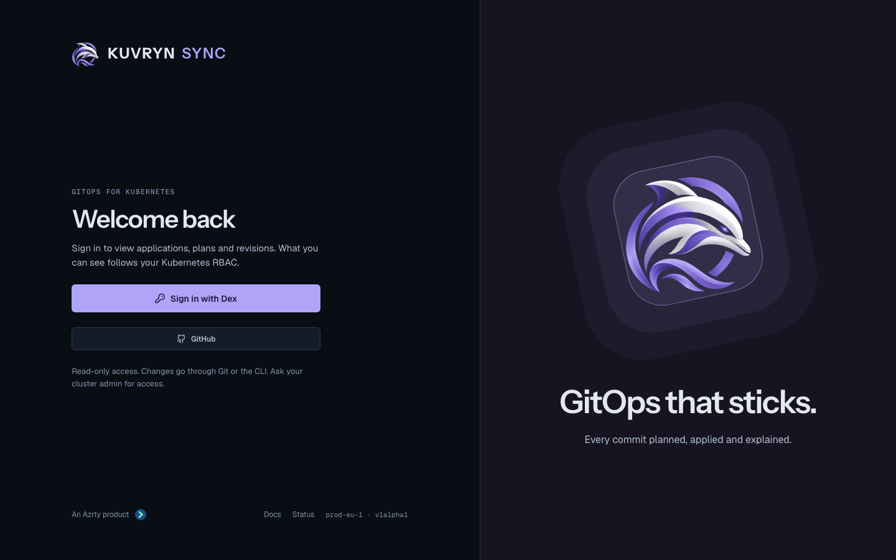
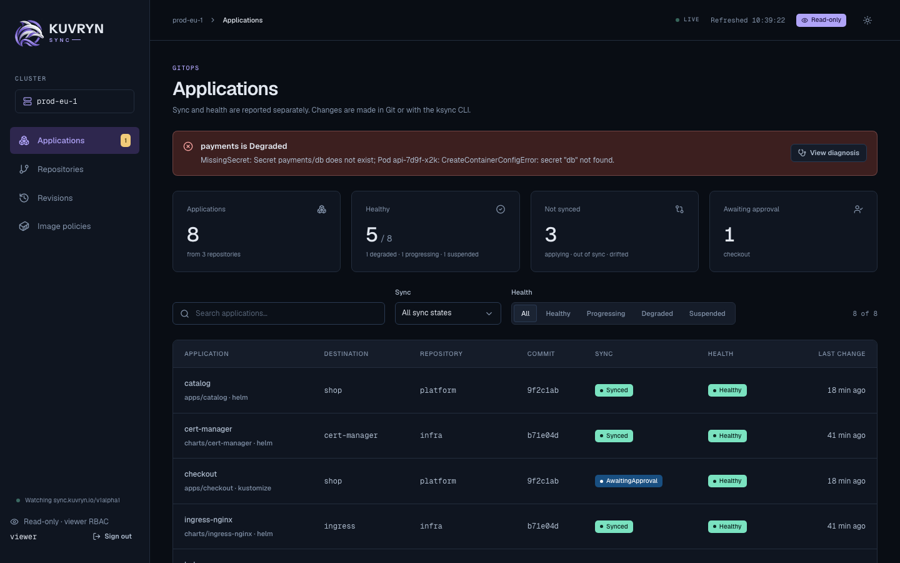
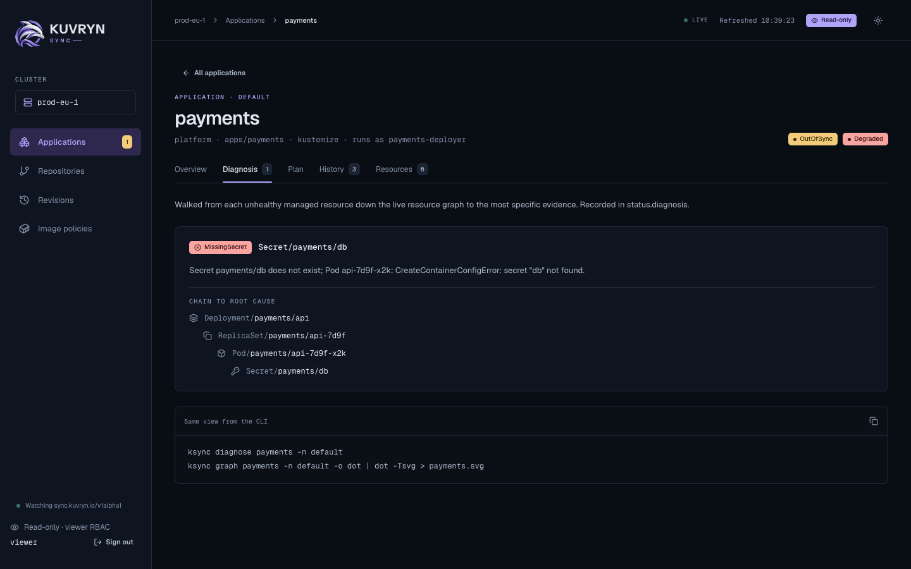

# Web console

`ksync console` serves a read-only web console for people who need to see
Kuvryn Sync state without a kubeconfig or the CLI:

- application teams checking why an Application is Degraded;
- approvers reading a plan before approving it with `ksync sync`;
- auditors reading Revisions;
- on-call staff scanning what is drifted or awaiting approval.

It shows Applications with their diagnosis chain, plan, history and managed
resources, and the Repositories, Revisions and Image policies tables. The
pages refresh every 10 seconds. The console never changes the cluster: where
an action is needed, it shows the exact `ksync` command instead.







## How access works

The console signs people in with OpenID Connect, then reads the cluster as
them. It does not have a permission model of its own:

- Sign-in uses the authorization code flow with PKCE (S256), state and
  nonce. The ID token's signature, issuer, audience and expiry are verified
  against the issuer's keys.
- The username comes from the ID token claim `--username-claim` (default
  `email`) and the groups from `--groups-claim` (default `groups`). Both
  prefixes are empty by default, so RBAC bindings name users and groups
  exactly as the issuer sends them.
- The identity is kept only in an encrypted cookie (`ksync_session`,
  AES-256-GCM, HttpOnly, Secure, SameSite=Lax) that expires with the ID
  token. Nothing is stored on the server, and no refresh token is kept, so
  users sign in again when the token expires.
- Every cluster read impersonates the signed-in user and their groups, so
  Kubernetes RBAC decides what each person sees, and the API server's audit
  log records the reads under their name.
- The console's ServiceAccount may only impersonate `users` and `groups`. Its
  client sends only GET requests, never reads Secrets, and refuses
  usernames or groups that start with `system:`.

The console runs as its own Deployment and ServiceAccount. It never shares
the controller's credentials.

> **The console's ServiceAccount is as powerful as cluster-admin.** Kubernetes
> lets a holder of `impersonate` on `users` and `groups` act as any user or
> group, `system:masters` included. The console refuses `system:` identities,
> but that check lives only in the console process: anyone who obtains the
> ServiceAccount's token can impersonate cluster-admin directly. Treat the
> release namespace like a cluster-admin credential. Allow nobody but
> cluster admins to exec into its pods, create pods there, or read its
> Secrets. Where you can, list the users and groups the console may
> impersonate in `console.impersonation`, as shown under
> [Restrict whom the console may impersonate](#restrict-whom-the-console-may-impersonate).

## Set up Dex

Any OIDC issuer works. This walk-through uses
[Dex](https://dexidp.io/), which the login page's GitHub, GitLab and email
buttons are designed for. Replace `console.example.com` and
`dex.example.com` with your hosts.

### 1. Register the console as a Dex client

Add a static client whose redirect URI is the console's `/auth/callback`:

```yaml
# Dex config.yaml
issuer: https://dex.example.com
staticClients:
  - id: ksync
    name: Kuvryn Sync
    secret: <a long random string>
    redirectURIs:
      - https://console.example.com/auth/callback
```

### 2. Add connectors

Each connector the console offers becomes a button on the login page. Pass
the connector IDs with `console.connectors`, and the console sends Dex's
`connector_id` so users skip Dex's own chooser.

```yaml
connectors:
  - type: github
    id: github
    name: GitHub
    config:
      clientID: $GITHUB_CLIENT_ID
      clientSecret: $GITHUB_CLIENT_SECRET
      redirectURI: https://dex.example.com/callback
      orgs:
        - name: acme
      # Groups arrive as "acme:platform"; bind RBAC to those names.
      teamNameField: slug
  - type: gitlab
    id: gitlab
    name: GitLab
    config:
      baseURL: https://gitlab.acme.io
      clientID: $GITLAB_CLIENT_ID
      clientSecret: $GITLAB_CLIENT_SECRET
      redirectURI: https://dex.example.com/callback

# The local connector: "Sign in with email" on the login page. Dex hosts the
# password form, so the console never sees a password.
enablePasswordDB: true
staticPasswords:
  - email: mia.chen@acme.io
    hash: <bcrypt hash>
    username: mia
    userID: 5d5a6c52-0f6a-4b9d-9a36-2b1f4c6e1a01
```

Dex's local users carry no groups, so bind RBAC to their email address.

### 3. Create the Secrets

The OIDC client secret, in the release namespace:

```sh
kubectl -n kuvryn-sync-system create secret generic ksync-console-oidc \
  --from-literal=client-secret='<the Dex client secret>'
```

The session key is 32 bytes. Without one, the console generates a random key
in memory at startup and logs that it did: every restart then signs everyone
out, and replicas cannot share sessions. The chart never generates the key
itself, because a random value in the chart would change on every render, and
a GitOps controller rendering it would rotate the key, and sign everyone out,
on every reconcile. Create it once and keep it:

```sh
head -c 32 /dev/urandom > session-key
kubectl -n kuvryn-sync-system create secret generic ksync-console-session \
  --from-file=session-key=session-key
rm session-key
```

Rotating the session key signs everyone out. `console.replicas` above 1
requires `console.sessionKey.secretName`; the chart refuses to render
otherwise.

### 4. Install the console with the chart

```yaml
# console-values.yaml
console:
  enabled: true
  oidc:
    issuerURL: https://dex.example.com
    clientID: ksync
    clientSecret:
      secretName: ksync-console-oidc
      key: client-secret
  # Optional for one replica: without it, sessions end when the pod restarts.
  sessionKey:
    secretName: ksync-console-session
    key: session-key
  clusterName: prod-eu-1
  ssoName: Dex
  connectors: [github, gitlab, local]
  docsURL: https://azrtydxb.github.io/kuvryn-sync/
  ingress:
    enabled: true
    className: nginx
    host: console.example.com
    tls:
      - secretName: console-example-com-tls
        hosts: [console.example.com]
```

```sh
helm upgrade --install kuvryn-sync charts/kuvryn-sync \
  --namespace kuvryn-sync-system -f console-values.yaml
kubectl -n kuvryn-sync-system rollout status deployment/kuvryn-sync-kuvryn-sync-console
```

The redirect URL defaults to `https://<ingress.host>/auth/callback`; set
`console.redirectURL` when the console is exposed some other way. The
console's cookies are `Secure`, so serve it over TLS.

The chart creates, all named `<release>-kuvryn-sync-console`:

- the Deployment, running `ksync console` as non-root with a read-only root
  filesystem;
- its ServiceAccount;
- a Service on port 80;
- the optional Ingress;
- a ClusterRole and ClusterRoleBinding that grant only `impersonate` on
  `users` and `groups`.

Every chart value:

| Value                                  | Default         | Meaning                                                           |
| -------------------------------------- | --------------- | ----------------------------------------------------------------- |
| `console.replicas`                     | `1`             | More than 1 needs `sessionKey.secretName`.                        |
| `console.enabled`                      | `false`         | Install the console.                                              |
| `console.oidc.issuerURL`               | (required)      | OIDC issuer URL.                                                  |
| `console.oidc.clientID`                | (required)      | OIDC client ID.                                                   |
| `console.oidc.clientSecret.secretName` | `""`            | Secret with the client secret; empty for a public client.         |
| `console.oidc.clientSecret.key`        | `client-secret` | Key in that Secret.                                               |
| `console.redirectURL`                  | from ingress    | `https://<host>/auth/callback`.                                   |
| `console.usernameClaim`                | `email`         | Claim impersonated as the username.                               |
| `console.groupsClaim`                  | `groups`        | Claim impersonated as the groups.                                 |
| `console.usernamePrefix`               | `""`            | Prefix added to the username.                                     |
| `console.groupsPrefix`                 | `""`            | Prefix added to each group.                                       |
| `console.sessionKey.secretName`        | `""`            | Secret with the 32-byte session key; empty keeps a key in memory. |
| `console.sessionKey.key`               | `session-key`   | Key in that Secret.                                               |
| `console.clusterName`                  | `cluster`       | Name shown in the console.                                        |
| `console.ssoName`                      | `""`            | Names the "Sign in with" button.                                  |
| `console.connectors`                   | `[]`            | Dex connectors offered: `github`, `gitlab`, `local`.              |
| `console.docsURL`, `console.statusURL` | `""`            | Links on the login page.                                          |
| `console.ingress.enabled`              | `false`         | Create an Ingress.                                                |
| `console.ingress.className`, `.host`   | `""`            | Ingress class and host.                                           |
| `console.ingress.annotations`, `.tls`  | `{}`, `[]`      | Ingress annotations and TLS.                                      |
| `console.resources`                    | small           | Container resources.                                              |

The same settings are `ksync console` flags when you run it yourself: `--listen`, `--oidc-issuer-url`,
`--oidc-client-id`, `--oidc-client-secret-file`, `--redirect-url`,
`--username-claim`, `--groups-claim`, `--username-prefix`,
`--groups-prefix`, `--session-key-file`, `--cluster-name`, `--sso-name`,
`--connectors`, `--docs-url`, `--status-url` and, for local development over
plain HTTP only, `--insecure-cookies`.

## Restrict whom the console may impersonate

By default the console's ClusterRole may impersonate any user and any group.
To limit it, list the users and groups that may use the console. Each
non-empty list becomes `resourceNames` on its impersonate rule:

```yaml
console:
  impersonation:
    users: [mia.chen@acme.io, sam.okafor@acme.io]
    groups: [acme:platform, acme:payments]
```

A person whose username or any of whose groups is not listed then gets
Forbidden on every page, because Kubernetes checks each impersonated name.
An empty list leaves that kind unrestricted; listing only users still lets
the ServiceAccount impersonate any group, `system:masters` included, so list
both to close the gap.

## Grant viewers access

The console adds no permissions: a person sees what their own RBAC lets them
read. A viewer needs `get` and `list` on the Kuvryn Sync resources, and on
the kinds their Applications manage to see the Resources tab. This
ClusterRole covers the common kinds; add the others your Applications manage.

```yaml
apiVersion: rbac.authorization.k8s.io/v1
kind: ClusterRole
metadata:
  name: kuvryn-sync-viewer
rules:
  - apiGroups: ["sync.kuvryn.io"]
    resources: ["*"]
    verbs: ["get", "list"]
  # Managed kinds shown on the Resources tab. Secrets are never read by the
  # console, so they need not be granted.
  - apiGroups: [""]
    resources: ["configmaps", "services", "serviceaccounts", "pods"]
    verbs: ["get", "list"]
  - apiGroups: ["apps"]
    resources: ["deployments", "statefulsets", "daemonsets"]
    verbs: ["get", "list"]
  # Lets the namespace picker list namespaces.
  - apiGroups: [""]
    resources: ["namespaces"]
    verbs: ["list"]
---
apiVersion: rbac.authorization.k8s.io/v1
kind: ClusterRoleBinding
metadata:
  name: kuvryn-sync-viewers
roleRef:
  apiGroup: rbac.authorization.k8s.io
  kind: ClusterRole
  name: kuvryn-sync-viewer
subjects:
  - apiGroup: rbac.authorization.k8s.io
    kind: Group
    name: acme:platform
```

For a team that should see only its own namespace, bind the same ClusterRole
with a RoleBinding in that namespace instead:

```sh
kubectl -n team-a create rolebinding kuvryn-sync-viewers \
  --clusterrole=kuvryn-sync-viewer --group=acme:team-a
```

## Troubleshooting

- **"Sign-in failed" right after starting:** the console could not reach
  the issuer yet. It retries discovery every 10 seconds, and `/healthz`
  reports `"oidc":"pending"` and answers 503 until it succeeds, so the pod
  is not Ready. Check the issuer URL and that the pod can reach it.
- **Sign-in fails with a missing claim:** the ID token has no claim named
  by `console.usernameClaim`. Dex sends `email` when the `email` scope is
  granted; for other issuers, set the claim they do send, such as
  `preferred_username`. A token whose `email_verified` is false is refused
  when the username claim is `email`.
- **Sign-in fails for an admin account:** usernames and groups that start
  with `system:` are refused, so the console can never act as a cluster
  component or as `system:masters`. Sign in with a personal account, and
  grant it what it should see.
- **Groups are missing:** Dex sends groups only when the `groups` scope is
  granted, which the console requests whenever `groupsClaim` is set, and
  only from connectors that provide them. Local users have none.
- **"Choose a namespace" appears:** the person may not list the resource
  across the cluster, which is expected for a namespace-scoped viewer. The
  picker lists the namespaces they may list, or asks them to type one when
  they may not list namespaces. The choice is kept in the browser.
- **Rows read "not visible with your permissions":** the person may not list
  that kind in the destination namespace. Secrets always read that way,
  because the console never reads them.
- **Every page is Forbidden:** the console's ServiceAccount cannot
  impersonate. At startup it checks this with SelfSubjectAccessReviews, logs
  the result, and `/healthz` reports `"impersonation":"missing"`. Check the
  `<release>-kuvryn-sync-console` ClusterRoleBinding.
- **Signed out after an upgrade or restart:** the session key changed, or
  the console generated one in memory because `console.sessionKey.secretName`
  is not set. Keep it in a Secret you manage if restarts and upgrades must not
  sign people out.

## Build and develop

The console UI is a React app under `web/`, built into the Go binary. Release
images always include it; a binary built without it serves a page explaining
how to build it.

```sh
make web-build        # needs Node 22
make test-ui          # Playwright against hack/console-dev
go run ./hack/console-dev
```

`hack/console-dev` serves the console on `http://127.0.0.1:5174` against a
local envtest API server with sample data, signed in as a viewer.
